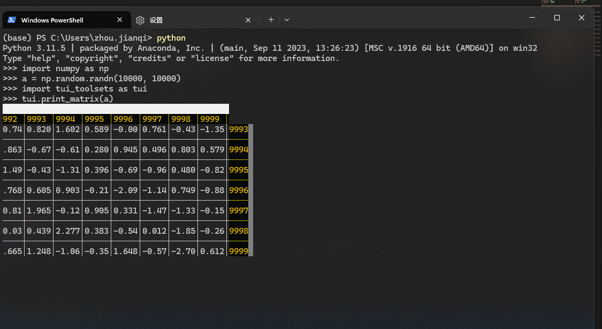
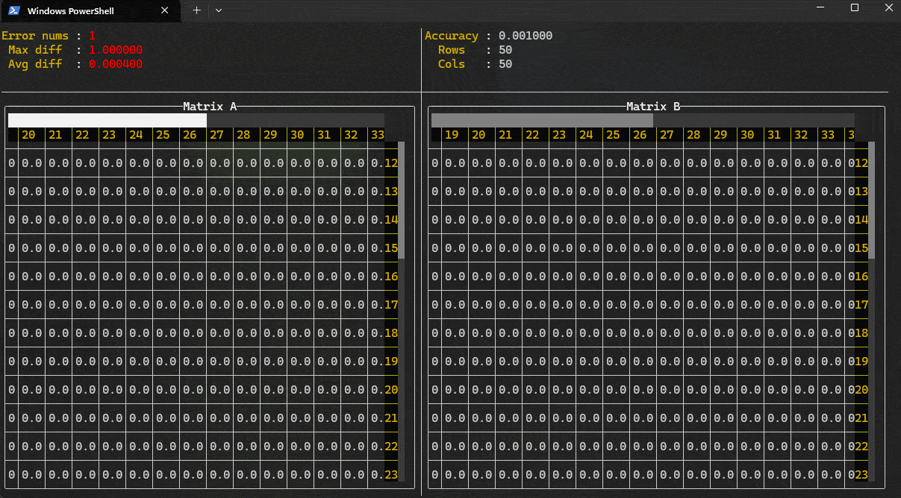
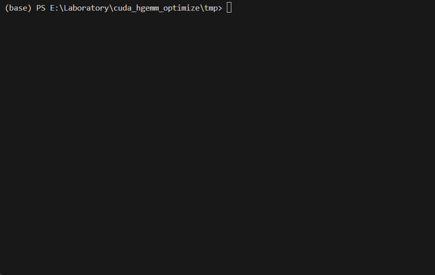

Simple Toolsets for HPC development. Depends on FTXUI, pybind11.

<table>
  <tr>
    <td>
      
    </td>
    <td>
      
    </td>
    <td>
      
    </td>
  </tr>
</table>

  <a href="#"></img></a>
  <a href="#"></img></a>
  <a href="https://opensource.org/license/mit"></img></a>
  <a href="#"></img></a>
  <a href="#"></img></a>
  <a href="#"></img></a>
  <a href="https://github.com/HeduAiDev/TuiToolsetsForHpc/graphs/contributors"></img></a>
  <a href="https://github.com/HeduAiDev/TuiToolsetsForHpc/issues"></img></a>
 
  <a href="https://github.com/HeduAiDev/TuiToolsetsForHpc/issues/new">Report a Bug</a> ·
  <a href="https://github.com/HeduAiDev/TuiToolsetsForHpc/issues/new">Request a Feature</a> ·
  <a href="https://github.com/HeduAiDev/TuiToolsetsForHpc/fork">Fork the Repo</a> ·
  <a href="https://github.com/HeduAiDev/TuiToolsetsForHpc/compare">Submit a Pull Request</a>
 

## Features
- support C++ and Python
- support very large matrix (over 10000 * 10000)

More features is comming soon! welcome to <a href="https://github.com/HeduAiDev/TuiToolsetsForHpc/issues/new">request a feature</a>

## install
for python
~~~shell
git clone  --recursive git@github.com:HeduAiDev/TuiToolsetsForHpc.git
cd TuiToolsetsForHpc
pip install -e .
~~~
for C++
~~~shell
git clone  --recursive git@github.com:HeduAiDev/TuiToolsetsForHpc.git
cd TuiToolsetsForHpc
cmake -S . -B build
cmake --build build --config Release -j8
cmake --install build --config Release --component CPPInterface --prefix <your_prefix>
~~~

## usage
| Keybinding | description         |
| ---------- | ------------------- |
| `Esc`      | Exit                |
| `Enter`    | Exit                |
| `Tab`      | ChangeFocus         |
| j          | scroll down slowly  |
| k          | scroll up slowly    |
| h          | scroll left slowly  |
| l          | scroll right slowly |

**Python**

~~~shell
>>> import tui_toolsets as tui
>>> a = [[1,2,3,4]] * 2
>>> tui.print_matrix(a)
████
 0 │ 1 │ 2 │ 3 │
1.0│2.0│3.0│4.0│0█
───┼───┼───┼───┤│
1.0│2.0│3.0│4.0│1
>>>
>>> import numpy as np
>>> tui.print_matrix(np.random.randn(100,100))
█████████████████████████▌
7 │48 │49 │50 │51 │52 │53 │54 │55 │56 │57 │58 │5
──┼───┼───┼───┼───┼───┼───┼───┼───┼───┼───┼───┼───
0.│1.5│0.3│0.3│-1.│0.7│0.3│-1.│0.1│1.8│-0.│0.0│147
──┼───┼───┼───┼───┼───┼───┼───┼───┼───┼───┼───┼───
.3│0.1│1.5│0.3│-1.│0.1│-0.│2.2│0.4│0.2│-0.│0.3│048
──┼───┼───┼───┼───┼───┼───┼───┼───┼───┼───┼───┼───
0.│0.4│0.4│-0.│0.0│0.7│1.9│0.9│0.1│-0.│-1.│-1.│-49
──┼───┼───┼───┼───┼───┼───┼───┼───┼───┼───┼───┼───▄
0.│-0.│0.4│1.0│-0.│2.2│0.9│-1.│0.8│-0.│1.1│-1.│050█
──┼───┼───┼───┼───┼───┼───┼───┼───┼───┼───┼───┼───█
1.│0.8│-1.│-0.│-0.│0.5│-0.│1.3│0.1│-1.│-0.│0.2│-51█
──┼───┼───┼───┼───┼───┼───┼───┼───┼───┼───┼───┼───█
0.│-0.│-0.│0.8│0.1│0.1│0.3│0.6│0.1│-0.│1.8│-0.│052█
──┼───┼───┼───┼───┼───┼───┼───┼───┼───┼───┼───┼───█
>>>
>>> import torch
>>> tui.print_matrix(torch.randn(100,100))
███████████████████
 │35 │36 │37 │38 │39 │40 │41 │42 │43 │44 │45 │46
─┼───┼───┼───┼───┼───┼───┼───┼───┼───┼───┼───┼────
9│0.3│-0.│1.2│-1.│-0.│0.1│0.1│0.3│-0.│-0.│-0.│0.47
─┼───┼───┼───┼───┼───┼───┼───┼───┼───┼───┼───┼────
5│-0.│1.9│-0.│1.0│0.6│1.5│-0.│0.4│-0.│0.1│-0.│0.48
─┼───┼───┼───┼───┼───┼───┼───┼───┼───┼───┼───┼────
.│-1.│-0.│1.6│-1.│0.2│0.0│1.6│0.7│-0.│1.5│2.4│-149
─┼───┼───┼───┼───┼───┼───┼───┼───┼───┼───┼───┼────▄
5│0.8│-1.│-1.│-0.│-0.│0.7│1.0│0.5│0.6│2.6│0.7│0.50█
─┼───┼───┼───┼───┼───┼───┼───┼───┼───┼───┼───┼────█
5│-1.│-0.│0.3│-1.│-0.│0.7│-2.│0.2│-1.│0.3│0.8│-051█
─┼───┼───┼───┼───┼───┼───┼───┼───┼───┼───┼───┼────█
.│-0.│-2.│0.6│0.0│1.1│0.3│1.0│-0.│-1.│0.8│-0.│-052█
─┼───┼───┼───┼───┼───┼───┼───┼───┼───┼───┼───┼────█
>>>

~~~

**C++**

1. add submodule

~~~shell
git submodule add https://github.com/HeduAiDev/TuiToolsetsForHpc 3rd/TuiToolsetsForHpc
git submodule update --init --recursive
~~~
2. config cmakeLists.txt
~~~CMake
cmake_minimum_required(VERSION 3.18)
project(Test LANGUAGES CXX)
set(CMAKE_CXX_STANDARD 17)
set(CMAKE_CXX_STANDARD_REQUIRED ON)
add_subdirectory(3rd/TuiToolsets)
add_executable(test src/main.cpp)
target_link_libraries(test PRIVATE tui_toolsets)
~~~
3. use in cpp file `src/main.cpp`
~~~cpp
#include <iostream>
#include "tui_tool_sets_runable.hpp"

int main() {
    int rows = 50;
    int cols = 50;
    float* a = new float[rows * cols];
    float* b = new float[rows * cols];
    a[rows + cols] = -1.f;
    tui::runable::print_matrix(a, rows, cols);
    // tui::runable::diff(a, b, rows, cols);
    // free your memory ...
    return 0;
}
~~~